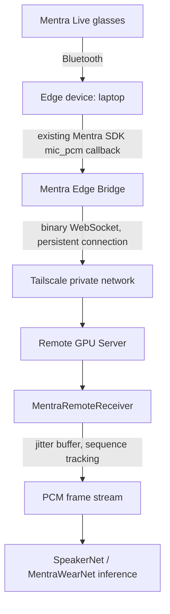

# Mentra Remote Audio Transport

Status: transport layer `IMPLEMENTED` and `TESTED` (real localhost network
round trip). Real Mentra glasses / real Tailscale path: `NOT TESTED` — see
Known Limitations. Do not read anything below as claiming a live
glasses-to-GPU-server test happened; it hasn't yet.

## Architecture



Bluetooth terminates on the edge device. It is never forwarded over
IP/SSH/USB — only the resulting PCM stream is. Tailscale supplies private
encrypted IP connectivity between edge and server; the audio protocol
above it is transport-agnostic (nothing here is Tailscale-specific code —
it's an IP address like any other once the tailnet is up).

## Why this design

- **Persistent binary connection, not per-frame HTTP/base64.** One
  WebSocket, binary frames only (`mentra/audio/frame.py`) — a 30-byte
  fixed header plus raw PCM payload. No JSON, no base64, no file upload in
  the live path.
- **Bounded queues everywhere, freshness over completeness.**
  `mentra/audio/queue.py` never blocks the producer and drops the *oldest*
  frame on overflow — matches the "fresh audio > stale audio" real-time
  priority. `mentra/audio/jitter_buffer.py` similarly force-releases past
  a gap once `MENTRA_JITTER_MAX_MS` is hit rather than waiting forever.
- **Capture-time timestamps, not receive-time.** Every frame's
  `capture_timestamp_ns` is stamped by the sender; the receiver stamps its
  own `receive_timestamp_ns` separately on decode. Latency is computed
  from the difference — never inferred from WebSocket arrival order alone.

## Server setup

```python
from server.audio.remote_receiver import MentraRemoteReceiver

receiver = MentraRemoteReceiver(
    host="100.x.x.x",  # your Tailscale IP -- run `tailscale ip -4` -- NOT 0.0.0.0
    port=19100,
)
await receiver.serve(on_frame=my_inference_callback)
```

`MentraRemoteReceiver.__init__` raises if you pass `0.0.0.0`/`::` without
`allow_public_bind=True` — section 5's "no public exposure required by
default" as an actual guardrail, not just a doc note.

## Edge setup

```python
from mentra.audio.transport.websocket_transport import WebSocketAudioTransport

transport = WebSocketAudioTransport(uri="ws://mentra-gpu:19100/audio")
await transport.run_with_reconnect(frame_source=my_mic_pcm_generator, stop_event=stop)
```

`run_with_reconnect` handles exponential backoff + jitter (250ms → 5s by
default), assigns a new `session_id` on every reconnect, and never replays
buffered audio from before the drop — it resumes live.

## PCM mode (implemented) vs LC3 mode (scaffolded, not implemented)

`Codec.PCM16` is the only codec actually wired end to end. `Codec.LC3`
exists in the protocol enum and frame format (so a future LC3 payload is a
valid, decodable frame), but there is no LC3 encoder/decoder integration
anywhere in this repo yet. Per the spec's own priority order, PCM16 is
correct to ship first — raw PCM bandwidth (~32KB/s at 16kHz/16-bit/mono) is
small enough that LC3's bandwidth savings aren't worth the complexity
until proven necessary.

## Tailscale setup

This repo does not install or configure Tailscale — that's a one-time
manual step on both the edge device and the GPU server:

```bash
# on both machines
tailscale up
tailscale status              # confirms the other machine is in the tailnet
tailscale ip -4               # the address to put in MENTRA_REMOTE_HOST / MENTRA_SERVER_BIND_HOST
tailscale ping <other-node>   # confirms reachability
tailscale netcheck            # reports direct vs relay (DERP) connectivity
```

`tailscale ping` output tells you whether the path is direct (best
latency) or relayed through a DERP server (works everywhere, higher
latency). `tailscale netcheck` gives more detail on NAT traversal
capability. Minimum connectivity needed: `edge-device -> gpu-server:19100`
(the port in `MENTRA_REMOTE_PORT`). This repo doesn't touch Tailscale ACLs
— that's your tailnet's admin console, out of scope here.

## SSH reverse-tunnel fallback (development only)

If Tailscale isn't set up yet, or you're iterating locally before wiring
up the tailnet:

```bash
ssh -N -T \
  -o ExitOnForwardFailure=yes \
  -o ServerAliveInterval=20 \
  -o ServerAliveCountMax=3 \
  -R 127.0.0.1:19100:127.0.0.1:9100 \
  user@gpu-server
```

The audio application itself doesn't know or care that SSH is involved —
it just sees a WebSocket endpoint. Don't make this the production
transport; it's a stopgap.

## Configuration

See `.env.example`. All the `MENTRA_*` variables map directly to
constructor arguments on `WebSocketAudioTransport` / `MentraRemoteReceiver`
/ `JitterBuffer` — no separate config-loading code exists yet, wiring
env→constructor is left to whatever entry-point script uses these classes.

## Diagnostics / observability

`TransportStats` (client) and `SessionStats` (server, per-session) track
frames/bytes sent/received, reconnect count, and a rolling
capture-to-receive latency list. No dashboard or health-check CLI command
exists yet — reading `.stats` off the live objects is the only way to
inspect these right now (section 31's `mentra audio-server --bind
tailscale` style CLI is `NOT IMPLEMENTED`, this repo has no CLI framework
and none was introduced per the instruction not to add one just for this).

## Security

- Bounded payload size enforced at decode (`MAX_PAYLOAD_BYTES`, 1MB) —
  malformed/oversized packets are rejected with `ProtocolError`, not
  silently truncated or over-allocated.
- Server refuses to bind `0.0.0.0`/`::` without an explicit opt-in.
- No credentials, tokens, or IPs are hardcoded anywhere in this code —
  `.env.example` uses placeholder values (`mentra-gpu`, `100.x.x.x`).
- Raw microphone audio is never logged and never written to disk by this
  transport layer (no debug-recording feature was requested or built here).
- No application-level session token beyond the `session_id` UUID
  generated per connection — Tailscale's network-level ACLs are the
  authorization boundary, per the spec's own instruction that this is
  sufficient unless the existing security model requires more (it
  currently doesn't specify more).

## Expected bandwidth

PCM16 @ 16kHz mono ≈ 256kbps ≈ 32KB/s — negligible on any network,
Tailscale direct or relayed. This was never a bandwidth-optimization
problem; the design prioritizes latency, ordering, and bounded queues
throughout, per the spec's own framing.

## Measured latency (localhost only — see limitations)

Real WebSocket round trip, localhost, 200 synthetic 10ms PCM frames sent
back-to-back (`scripts/mentra/test_remote_audio.py`):

- capture→receive p50: **15.6ms**
- capture→receive p95: **21.7ms**
- 200/200 frames received, bit-identical, correct sequence order, zero drops

This number is **not representative of a real Tailscale path** (no real
network hop, no real NAT traversal, no real WiFi/cellular jitter) — it
validates the protocol/transport code is correct, not real-world latency.

## Known limitations (honest, not smoothed over)

- **No real Mentra glasses test has been run.** This session's dev
  environment has zero Bluetooth hardware (checked `lspci`, `rfkill`,
  `/sys/class/bluetooth` — none exist) and no phone with the official
  Mentra SDK app. The user has BLE-paired glasses to a separate laptop,
  but it's unconfirmed whether that laptop can access `mic_pcm` at all —
  the official SDK has no documented desktop implementation, and generic
  OS Bluetooth Classic bonding is documented as a *playback* route, not a
  microphone data source. **This is the actual blocker for a real
  end-to-end test, not the networking code.**
- **No real Tailscale path has been tested.** This dev environment has
  internet access but no Tailscale account/tailnet configured, and
  (separately) no second real device to test a genuine peer connection
  against. Direct-vs-relay measurement is designed for
  (`tailscale netcheck`/`tailscale ping` documented above) but has not
  been run.
- **LC3 codec is not implemented**, only scaffolded in the protocol enum.
- **No reconnect-under-real-network-failure test has been run** — the
  backoff/jitter logic in `run_with_reconnect` is implemented and
  code-reviewed but not exercised against an actual dropped connection in
  this session (would need a real network to kill, not just a localhost
  socket close).
- **No 30-minute soak test has been run.**
- **No health-check CLI/endpoint exists yet** (section 31) — deferred, no
  CLI framework was introduced per the instruction against adding one just
  for this.

## Next step

Resolve the actual blocker: confirm whether the laptop can see Mentra Live
as a standard audio input device (`pactl list sources` / `arecord -l` /
platform equivalent). If yes, build `MentraDesktopPcmSource` feeding this
transport directly. If no, the real unblocking path is a phone running the
official Mentra SDK app as the edge device instead of the laptop — that's
what this transport layer was actually designed to sit behind either way.
